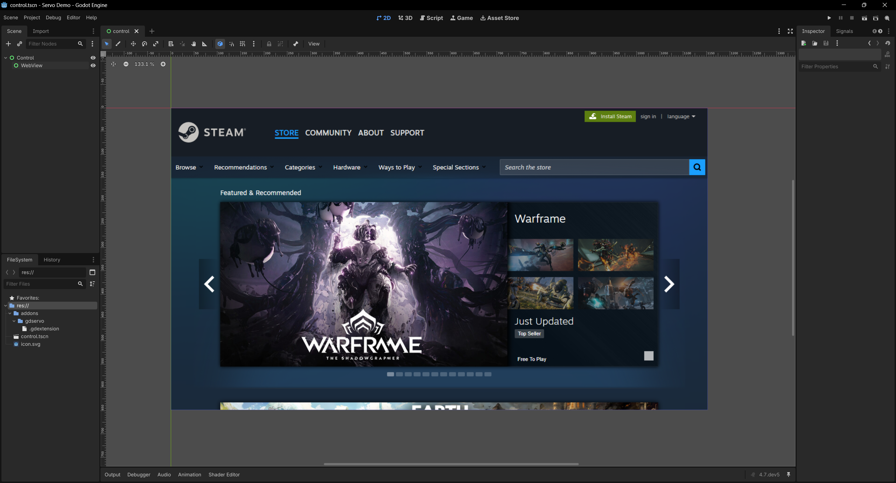

# Godot Servo

## Currently Useful

* [RenderingDevice.get_driver_resource()](https://docs.godotengine.org/en/latest/classes/class_renderingdevice.html#class-renderingdevice-method-get-driver-resource)
* [RenderingDevice::DRIVER_RESOURCE_TEXTURE](https://docs.godotengine.org/en/latest/classes/class_renderingdevice.html#class-renderingdevice-constant-driver-resource-texture)

## References

* [Servo](https://docs.rs/servo/0.1.0/servo/)
* [WebView](https://docs.rs/servo/0.1.0/servo/struct.WebView.html)
* [WebViewDelegate](https://docs.rs/servo/0.1.0/servo/trait.WebViewDelegate.html)
* [SoftwareRenderingContext](https://docs.rs/servo/0.1.0/servo/struct.SoftwareRenderingContext.html)

## Reading
* [Using Servo with Slint](https://slint.dev/blog/using-servo-with-slint)
* [Embedding the Servo Web Engine in Qt](https://www.kdab.com/embedding-servo-in-qt/)
